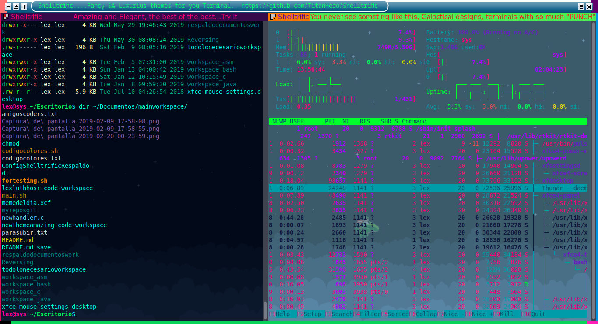

# **Shelltrific**               




### Repo with more of 100 amazing themes for the terminal [terminator](https://gnometerminator.blogspot.com/p/introduction.html), why you shell must to be boring? fill it of life with Shelltrific


## *How configure*

### Easy you only run the script`installerMain.sh` and follow the instructions, remember... for change the theme press `Ctrl+Super+t`, and for run the script only do this, is very easy(use GnuLinux), first you have to give permissions of execution to the script and then run the **BashScript** example:

```bash
$ sudo chmod u+x installerMain.sh; ./installerMain.sh
```
---


### If, you liked this themes, you could give me a f#*c71@g(Sorry I'm desesperate) star that should will be very cool, you will be my hero, like of kind of what if Chuck Norris merge with Itachi\([Character of Naruto](https://en.wikipedia.org/wiki/Itachi_Uchiha), tells the legend that Itachi self writes self in the manga ) and Shanks\([Character of One Piece](https://en.wikipedia.org/wiki/List_of_One_Piece_characters#Shanks)..you know Shanks \) and the result of this polimeritation, his job is like pro porn actor and his character is BBC(Porn terming), you know, like me.....anyway.. please? Like a favour? like a charity, we will be little brothers, you know... homies coders,  my life don't worth nothing without stars in my repos,the doctor prescribe me stars in my repos all the mornings,  right now I'm crying(I'm cutting onions ) , anyway so and if you think that it don't deserve a star, I notice you, that just only for see the gif and visit this repo you owe me a star, lol, is joke (also I'm comedian, I just try it, you know... I say so much stupidities all day, I have to take approach of that,)but yeah, that motivates me to still working, I worked a lot in this , was nights without sleep, so the minimum for this is a simple star, nothing costs you is just a button,  that motivates me a lot to still working in things like this and making open source, due it show me that my repos are helpful,  and I don't wasted my life 
> ....lol is't joke...
